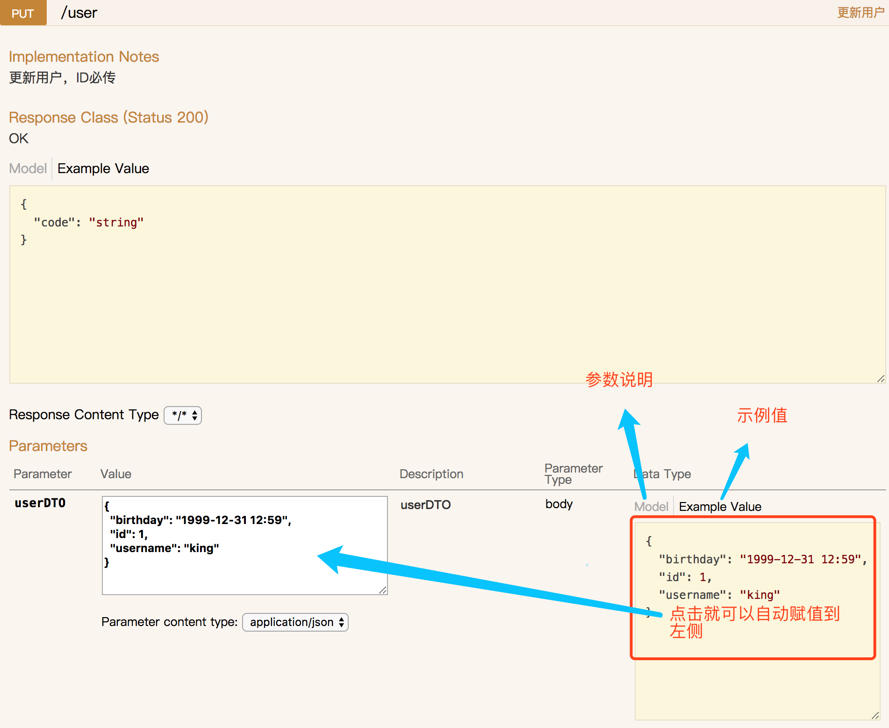
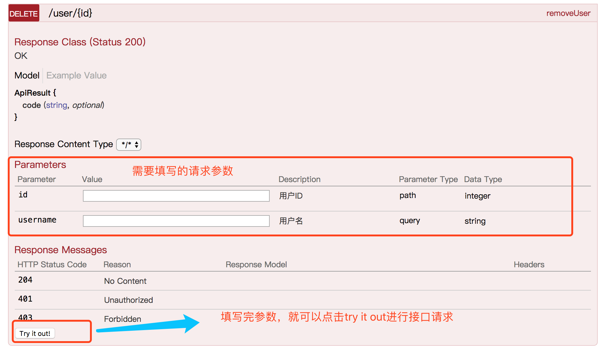

## SpringBoot如何优雅的使用Swagger

可以参考我的github项目[kingboy-springboot-web](https://github.com/KingBoyWorld/kingboy-springboot-web/tree/feature_swagger)，包含详细的演示和说明以及其它相关技术。

### 一、Swagger为什么会出现？

在以前，我们项目开发的流程往往是这样的：

产品把前后端人员叫过来开会：我们的需求是这样的，balabala。然后前端拿着原型页面开始画前台UI，后端看着需求文档开始写接口。

后端写完一个接口，肯定需要测试一下写的对不对，那么经常有这样一个过程：

    - 打开一个模拟http请求工具，例如postMan
    - 填写接口的请求地址
    - 如果是post带body的请求，还要拼接一长串的json字符串，哪怕错一个字符都不行
    - 请求后台接口

当前后台开发完成时，前后端两个人开始联调，往往会出现以下情景：

对话一：

    - 前端：你这手机字段名怎么叫phone?我的叫phoneNumber
    - 后端：??!!
    - 前端：不行，就你改

对话二：

    - 前端：你这接口怎么调不通？
    - 后端：额，我看看 ………2 minutes later……… 我接口文档忘记更新了，接口格式已经改了，所以调不通
    - 前端：...

对话三：

    - 前端：你这个接口里的id传的是用户id还是订单id?
    - 后端：等会，我看看……………2 minutes later………………
    - 后端：再等会，我代码里注释忘记同步修改了，我查下数据库…………

以上的情景时常发生，究其原因是因为前后端不能很好的同步信息，既耽误时间，又消耗精力，而我们关注的核心应该是代码。

在联调前，开发人员还要写接口文档(一种令人蛋疼的东西)，当代码改动时，一般也要同步修改接口文档(然而……)。

那么有没有那么一个工具可以帮我们去做这些事呢？可不可以让我们只关注我们的代码书写呢？肯定是有的，那就是Swagger。

### 二、Swagger解决了什么问题？

Swagger会自动根据我们的接口来生成一个html页面，在这个页面上我们可以看到所有接口信息，信息中包含了有哪些参数，每个参数代表什么意思，如果是一个带body体的请求，还会自动帮我们生成json格式的bogy。并且还可以像http请求工具那样进行接口请求，示例如下。

接口代码:
```java
    @ApiOperation(value = "更新用户", notes = "更新用户，ID必传")
    @PutMapping
    public ApiResult updateUser(@RequestBody UserDTO userDTO) {
        return ApiResult.success("success");
    }

    @DeleteMapping("/{id}")
    public ApiResult removeUser(@ApiParam(value = "用户ID") @PathVariable(value = "id")  Integer id,
                                @ApiParam(value = "用户名") @RequestParam String username) {
        return ApiResult.success("success");
    }
```


生成的html页面

>>>> 
>>>> 

### 三、SpringBoot集成Swagger的环境准备

1.引入依赖
```java
//spring mvc
'org.springframework.boot:spring-boot-starter-web',
"com.fasterxml.jackson.datatype:jackson-datatype-jsr310",
//swagger
"io.springfox:springfox-swagger2:$swaggerVersion",
"io.springfox:springfox-swagger-ui:$swaggerVersion",
```

2.Swagger配置
我们写一个Swagger的配置类如下：
```java
/**
 * @author kingboy--KingBoyWorld@163.com
 * @date 2017/12/30 下午7:30
 * @desc Swagger配置类.
 */

@EnableSwagger2//Swagger的开关，表示我们在项目中启用Swagger
@Configuration//声名这是一个配置类
@ConfigurationProperties(prefix = "swagger")//SpringBoot中提供的属性自动赋值。也可以直接在属性上使用@Value("${swagger.属性名}")进行赋值
public class SwaggerConfiguration {

    //controller接口所在的包
    private String basePackage = "com.kingboy.controller";

    //当前文档的标题
    private String title = "他很懒，什么都没有留下";

    //当前文档的详细描述
    private String description = "他很懒，什么都没有留下";

    //当前文档的版本
    private String version = "V1.0";

    @Bean
    public Docket createRestApi() {
        return new Docket(DocumentationType.SWAGGER_2)
                .apiInfo(apiInfo())
                .select()
                .apis(RequestHandlerSelectors.basePackage(basePackage))
                .paths(PathSelectors.any())
                .build();
    }

    private ApiInfo apiInfo() {
        return new ApiInfoBuilder()
                .title(title)
                .description(description)
                .version(version)
                .build();
    }

    //Setter Getter ...

}
```

3.配置文件，这里使用yml文件进行配置
resources/application.yml
```yml
swagger:
  basePackage: com.kingboy.controller
  title: 用户服务
  description: 用户基本增删改查
  version: V1.0
```

### 四、Swagger的使用方法

Swagger的使用注解有很多，这里我们只讲最常用的注解，以及这些注解中最常用的属性。
- @Api(value = "用户Controller")
    - 加在controller类上
    - value表示该类的描述
    - 然而我发现加不加，在swagger的页面上没有任何的体现，所以我并没有加
- @ApiOperation(value = "获取用户信息", notes = "通过id获取用户")
    - 加在相应的请求处理方法上
    - value表示该方法的说明
    - note相当于对该方法的详细说明，也就是更加完整的描述
- @ApiParam(value = "用户ID")
    - 加在请求方法的普通参数上
    - value的值是对该参数的说明
    - 需要注意的是，@RequestParam注解不能省略，否则Swagger会当做body进行解析。
- @ApiModel(value = "用户信息")
    - 加在请求方法的请求对象的类上
    - 例如有一个请求方法saveUser(User user), 则需要加在User这个类上面(可以参照下面的示例)
- @ApiModelProperty(value = "用户ID", example = "1")
    - 加在请求方法的参数对象的属性上
    - value 对该属性的描述
    - example 代表swagger文档中自动生成的json的默认值
- @ApiImplicitParams(value = {})
    - 用在请求方法上
    - 这个注解必须和下面的@ApiImplicitParam配合使用
    - 当请求方法中的请求参数很多的时候，例如saveUser(String username, Integer age, Date birthday, String phone),这个时候我们如果还是使用@ApiParam会让方法体变的非常乱。
- @ApiImplicitParam(name = "id", paramType = "path", value = "用户ID")
    - 用在@ApiImplicitParams的value中
    - name 参数中属性的名字
    - paramType 这个参数必须指定，代表参数的传输类型，有五个取值：path(url参数),query(请求参数), body(请求体参数)，header(头部参数)，form(表单参数)。
    - value 对这个属性的描述
    - 再此强调一下，paramType不能少，paramType不能少，paramType不能少

下面直接看示例：

UserController

```java
/**
 * @author kingboy--KingBoyWorld@163.com
 * @date 2017/11/26 下午1:20
 * @desc 用户接口服务.
 */
@RestController
@RequestMapping(value = "/user")
public class UserController {

    @ApiOperation(value = "获取用户信息", notes = "通过id获取用户")
    @GetMapping(value = "/{id}")
    @ApiImplicitParams(value = {
            @ApiImplicitParam(name = "id", paramType = "path", value = "用户ID"),
            @ApiImplicitParam(name = "username", paramType = "query", value = "用户名")
    })
    public ApiResult getUser(@PathVariable(value = "id") Integer id, @RequestParam String username) {
        return ApiResult.success(new UserDTO(id, username, LocalDateTime.now()));
    }

    @ApiOperation(value = "保存用户", notes = "保存用户，ID为后台自动生成")
    @PostMapping
    public ApiResult saveUser(@RequestBody UserDTO userDTO) {
        return ApiResult.success(userDTO);
    }

    @ApiOperation(value = "更新用户", notes = "更新用户，ID必传")
    @PutMapping
    public ApiResult updateUser(@RequestBody UserDTO userDTO) {
        return ApiResult.success("success");
    }

    @DeleteMapping("/{id}")
    public ApiResult removeUser(@ApiParam(value = "用户ID") @PathVariable(value = "id")  Integer id,
                                @ApiParam(value = "用户名") @RequestParam String username) {
        return ApiResult.success("success");
    }

}
```


UserDTO

```java
@Data
@ApiModel(value = "用户信息")
@NoArgsConstructor
@AllArgsConstructor
public class UserDTO {

    @ApiModelProperty(value = "用户ID", example = "1")
    private Integer id;

    @ApiModelProperty(value = "用户名", example = "king")
    private String username;

    @ApiModelProperty(value = "生日", example = "1999-12-31 12:59")
    @JsonFormat(pattern = "yyyy-MM-dd HH:mm")
    private LocalDateTime birthday;
}

```


